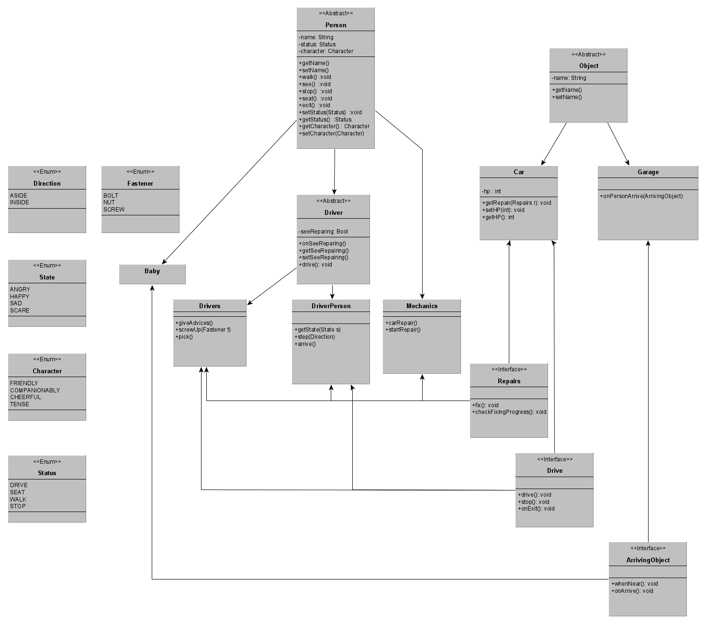

Лабораторная работа №3 
---
Никулин Арсений R3136

Вариант: 85323


Текст:
 ```Когда малышки подошли к гаражу, то увидели, что, кроме Винтика и Шпунтика, приехал Бублик. Бублик рассердился и отошел в сторону. Но он не уехал. Увидев, что Винтик и Шпунтик начали починять машину, он принялся им помогать. Такой уж компанейский характер у каждого шофера. Если шофер увидит, что кто-нибудь починяет машину, он обязательно подойдет и тоже начнет что-нибудь ковырять, подвинчивать болт или гайку, или просто станет давать советы.```


Диаграмма uml:

